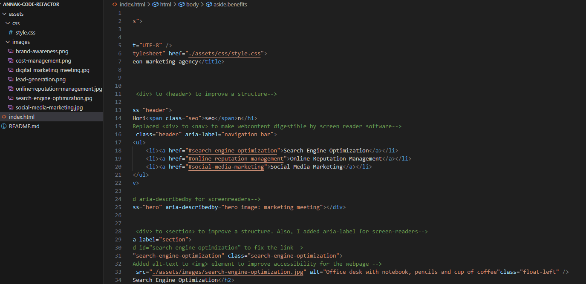

# AnnaK-code-refactor

## Description

* My motivation was to learn a code refactoring and put a theory into practice. 
* I built this project to improve the provided starter code accoridng with the specified criteria
* It solves a few problems:

1. The semantic structure of HTML looks more organized.
2. The header with agency's logo and links looks more attractive for customers.
3. All links at Navbar are function correctly.
4. CSS selectors and properties are consolidated appropriately.
5. The webpage suffies the accessibility requirements. 

* I learned the following:

1. Refactoring is a common customers' request, which helps to improve the exciting code.
2. Web accessibility standards.

## Installation

There are no changes that affect the installation process.

## Usage

To use this "AnnaK-code-refactor", you can review the comments at index.html and style.css pages or see the screenshots.

## Deployed link

[deployed link](https://explorer7733.github.io/AnnaK-code-refactor/)

## Screenshots

## Credits

I followed the following tutorials:

<https://medium.com/@OPTASY.com/writing-html-code-for-screen-readers-6-best-practices-bf8f2248318>

<https://stackoverflow.com/questions/4796361/html-document-markup-for-accessibility>

<https://bitsofco.de/html-for-screen-readers-labelling-elements/>

